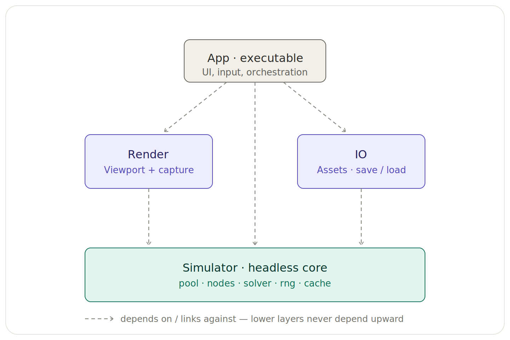

# SparkFlowFX

A node based, procedural particle FX editor written in C++20.

## Architecture

SparkFlowFX has four layers. The central rule
is that **lower layers never depend on upper layers** — in particular the
simulation core has no dependency on the renderer, the UI, or OpenGL, so it
builds and runs headless and is fully testable on its own.

The **Simulator** is the deterministic, headless simulation engine of SparkFlowFX: it manages the particle pool, node operators, solver, RNG, and per-frame caching. **Render** owns the OpenGL pipeline for both the live viewport and offscreen capture. **IO** handles asset import and save/load operations. **App** is the executable that hosts the window and UI and orchestrates everything above.
